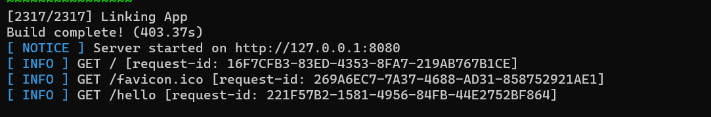

# vapor_hello_world




# Introduction 

Welcome to the Vapor App Documentation! This project is a simple "Hello World" application deployed using the Vapor framework. Vapor is a web framework for Swift, allowing you to write backends, web apps, APIs, and HTTP servers in Swift. Swift is a modern, powerful, and safe language that provides numerous benefits over more traditional server-side languages.

## Table of Contents

- [Introduction](#introduction)
- [Installation](#installation)
- [Running the Application](#running-the-application)
- [Project Structure](#project-structure)
- [Further Reading](#further-reading)

## Introduction

This project is a basic Vapor application that serves a "Hello, world!" message at the root URL. It serves as an introduction to deploying applications using Vapor and provides a foundation for building more complex web applications.

## Installation

To get started with this Vapor app, you need to have the following prerequisites installed on your machine:

- Swift 5.2+: Ensure you have Swift installed. You can download it from [swift.org](https://swift.org/download/).

```swift
FOR LINUX:

curl -L https://swift-server.github.io/swiftly/swiftly-install.sh | bash

FOR MacOS:

Swift and all of its dependencies come bundled with Xcode.

Install Xcode from the Mac App Store.
```

- Vapor Toolbox: This is a command-line tool that helps with Vapor project management. You can install it using Homebrew:


```sh
brew install vapor
```

or

```sh
git clone https://github.com/vapor/toolbox.git
cd toolbox
git checkout <desired version>
make install
```
## Running the Application

Once you have the necessary prerequisites installed, follow these steps to run the application:

1. Clone the repository:


```swift
git clone https://github.com/csabika98/vapor_hello_world.git
cd <repository-directory>
```

2. Install dependencies:

```swift
vapor update
```
3. Run the application:
```swift
vapor run
```
4. Access the application:
```swift
Open your web browser and navigate to `http://localhost:8080`
```
You should see a "Hello, world!" message.

## Project Structure

Here is a brief overview of the project's structure:

- `Sources/App/`: Contains the main application code.
  - `Controllers/`: Contains controllers for handling different routes.
  - `Models/`: Contains data models.
  - `Routes.swift`: Defines the routes for the application.
- `Sources/Run/`: Contains the main entry point for the application.
- `Public/`: Static files to be served by the application.
- `Resources/`: Resource files for the application.
- `Tests/`: Contains unit tests for the application.

## Using a Process Manager

Install pm2:

```sh
npm install -g pm2
```

Run your app:
```sh
pm2 start swift -- run
```
Stop your app:
```sh
pm2 stop swift
```
Restart your app:
```sh
pm2 restart swift
```
Debugging:
```sh
pm2 logs swift
```

For more information on Vapor and its features, check out the [official Vapor documentation](https://docs.vapor.codes/).

---

Thank you for using Vapor! If you encounter any issues or have any questions, feel free to open an issue on the project's GitHub repository or consult the Vapor community for help.

